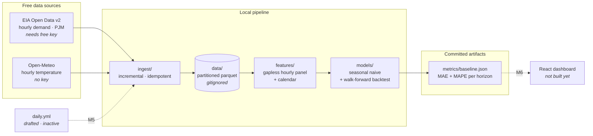

# energy-forecast-drift

Hourly **electricity demand forecasting** for a US balancing authority (PJM),
built around a live data feed so that **model drift is real, not simulated**.

The point of the project is not the forecast. It is the loop around it: a free
cron pulls fresh demand and weather every day, re-scores the model against the
actuals that arrive, and commits the metrics back to the repo — so drift
accumulates in public, week after week, and can be pointed at.

> **Milestone status: M0 + M1 complete** — ingestion and the seasonal-naive
> baseline with a walk-forward backtest. LightGBM, MLflow, drift detection and
> the dashboard are M2–M6 and are deliberately not built yet.

---

## ⚠️ Current state: the baseline number is pending an API key

The EIA API key had not been registered when this milestone was built, so
**there is no real demand history in the lake yet**, and therefore **no real
baseline MAE**.

- The Open-Meteo leg is **real and running today** — no key needed.
- The EIA client is **finished, not stubbed**, and runs the moment a key lands.
- `metrics/baseline.json` currently holds numbers computed from a **seeded
  synthetic fixture**. They prove the pipeline executes end to end. They are
  **not a result and must not be quoted.** Every artifact says so
  (`"is_real": false`).

Four steps to unblock it: **[docs/BLOCKED.md](docs/BLOCKED.md)**.

---

## Architecture



## Quickstart

```bash
uv sync --extra dev            # Python 3.11+, deps pinned in uv.lock

cp .env.example .env           # then paste your EIA key (see docs/BLOCKED.md)

uv run python -m ingest        # pull the delta from both sources
uv run python -m ingest        # re-run: reports +0 new rows — it is idempotent

uv run python -m models        # walk-forward backtest -> metrics/baseline.json
uv run pytest -v               # 37 tests, no network
```

Useful flags:

| Command | Effect |
|---|---|
| `python -m ingest --source weather` | run one leg only (`eia`, `weather`, `all`) |
| `python -m ingest --full-refresh` | ignore the lake and re-pull the whole backfill |
| `python -m models --source real` | fail loudly instead of falling back to the fixture |
| `python -m models --source synthetic` | force the fixture (what CI smoke-tests) |
| `python -m models --weeks 12` | widen the backtest window |

## Baseline (M1)

**Model:** seasonal naive — `demand(T) = demand(T - 168h)`, i.e. the same hour
one week earlier. For an hourly load series this single lag captures the daily
shape *and* the weekday/weekend split, which makes it a genuinely hard trivial
benchmark, and a much fairer one than a 24 h naive.

**Protocol:** walk-forward, 56 daily folds over the last 8 weeks. At each fold
cutoff `T0` the model sees the series strictly before `T0` and forecasts
`T0+1 … T0+24`. Metrics are computed per horizon, then pooled.

<details>
<summary><b>⚠️ SYNTHETIC — pipeline smoke test, NOT a result. Click to expand.</b></summary>

These numbers come from `models/fixtures.py` (a seeded curve), not from the
EIA. They exist only to show the backtest runs and the artifact is well formed.
The real table replaces this one as soon as the key lands.

| Horizon (h) | MAE (MWh) | MAPE (%) | RMSE (MWh) | Bias (MWh) | n |
|---:|---:|---:|---:|---:|---:|
| 1 | 2,621 | 3.36 | 3,155 | -779 | 56 |
| 6 | 2,491 | 3.27 | 3,244 | -485 | 56 |
| 12 | 2,681 | 2.53 | 3,322 | -500 | 56 |
| 18 | 2,906 | 2.46 | 3,397 | -520 | 56 |
| 24 | 2,844 | 3.46 | 3,623 | -178 | 56 |
| **overall** | **2,559** | **2.77** | 3,173 | -487 | 1,344 |

Full per-horizon table: [`metrics/baseline_table.md`](metrics/baseline_table.md).

</details>

**This MAE is the number every future model must beat.** M2 (LightGBM with
lags, calendar and temperature) is only worth shipping if it wins on the same
folds, the same horizons and the same protocol.

## Design decisions worth defending

**Ingestion is incremental *and* idempotent.** The store de-duplicates on
`(entity, timestamp)` keeping the newest row, so re-running never duplicates an
hour — and because the EIA revises recent values, every run deliberately
re-pulls a 3-day tail so revisions *overwrite* stale numbers instead of being
ignored forever. Partition files are written to a temp path and moved into
place, so an interrupted run cannot leave a corrupt parquet.

**No temporal leakage, enforced in two places.** `backtest._history_before`
slices with `index < cutoff` (strictly — the hour stamped `T0` is not complete
at `T0`), and `baseline.predict` independently re-asserts that neither the
history it received nor the seasonal lag it is about to read touches the
cutoff. A test poisons every value after the last fold and asserts the metrics
do not move; another spies on the model and asserts it never saw a timestamp
`>= cutoff`.

**The panel is gapless.** Missing hours become explicit NaNs rather than
shifting the index, so "168 rows ago" and "168 hours ago" stay the same thing.
A fold with a gap in its actuals is *skipped and reported*, never silently
scored — so every horizon is evaluated on an identical fold set and the columns
are comparable.

**Secrets cannot leak.** `.env` is gitignored, URLs are redacted before logging
and secret-looking query params are masked; a test asserts a key cannot survive
either path. A 401/403 is never retried — a bad key only burns quota.

**Rate limits are respected structurally.** All HTTP goes through one helper:
max 3 attempts, exponential backoff (2s/4s/8s), `Retry-After` honoured and
capped, sleeps between pages, and only transient statuses retried. No client
can bypass it.

**The lake is not committed.** `data/` is gitignored; `metrics/` holds only
small JSON that the future cron will refresh — it is the published surface the
M6 dashboard will read.

## Layout

```
ingest/     EIA v2 + Open-Meteo clients, polite HTTP, partitioned parquet store
features/   gapless hourly panel, weather join, calendar features
models/     seasonal-naive baseline, walk-forward backtest, synthetic fixture
metrics/    committed artifacts (baseline.json, baseline_table.md)
tests/      37 tests: idempotency, leakage, retry policy, secret redaction
docs/       spec.md (original brief), BLOCKED.md (the EIA key)
.github/    ci.yml (active on publish) · daily.yml (drafted, inactive)
```

## Next milestones

| | | |
|---|---|---|
| **M2** | LightGBM + walk-forward | lags 24/168h, rolling stats, calendar, temperature — scored against this baseline on identical folds |
| **M3** | MLflow | experiment tracking + registry; serving loads the champion |
| **M4** | Drift | feature / target / prediction / **performance** drift (PSI + KS), thresholds, retrain trigger |
| **M5** | Live cron | activate `daily.yml`: ingest → score → commit `metrics/` |
| **M6** | Dashboard + serving | React reading `metrics/`, FastAPI `/forecast` |
| **M7** | Writeup | one real drift episode, captured end to end |

Full brief: [`docs/spec.md`](docs/spec.md).

## Cost

R$0. EIA and Open-Meteo are free, GitHub Actions is free on a public repo, and
the future dashboard is static hosting. No server stays on.
