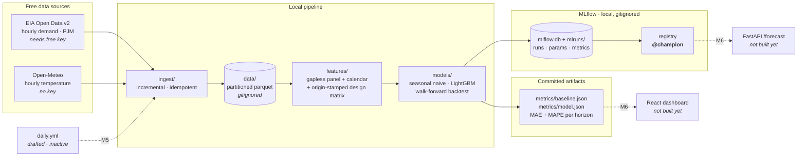

# energy-forecast-drift

Hourly **electricity demand forecasting** for a US balancing authority (PJM),
built around a live data feed so that **model drift is real, not simulated**.

The point of the project is not the forecast. It is the loop around it: a free
cron pulls fresh demand and weather every day, re-scores the model against the
actuals that arrive, and commits the metrics back to the repo — so drift
accumulates in public, week after week, and can be pointed at.

> **Milestone status: M0 → M3 complete** — ingestion, the seasonal-naive
> baseline, a global LightGBM scored on the same walk-forward folds, and MLflow
> tracking + registry. Drift detection, the live cron and the dashboard are
> M4–M6 and are deliberately not built yet.

---

## ⚠️ Current state: the baseline number is pending an API key

The EIA API key had not been registered when this milestone was built, so
**there is no real demand history in the lake yet**, and therefore **no real
baseline MAE**.

- The Open-Meteo leg is **real and running today** — no key needed.
- The EIA client is **finished, not stubbed**, and runs the moment a key lands.
- `metrics/baseline.json` and `metrics/model.json` currently hold numbers
  computed from a **seeded synthetic fixture**. They prove the pipeline executes
  end to end. They are **not a result and must not be quoted** — including the
  LightGBM-vs-baseline delta below. Every artifact says so (`"is_real": false`).

Four steps to unblock it: **[docs/BLOCKED.md](docs/BLOCKED.md)**.

---

## Architecture



## Quickstart

```bash
uv sync --extra dev            # Python 3.11+, deps pinned in uv.lock

cp .env.example .env           # then paste your EIA key (see docs/BLOCKED.md)

uv run python -m ingest        # pull the delta from both sources
uv run python -m ingest        # re-run: reports +0 new rows — it is idempotent

uv run python -m models        # M1: walk-forward backtest -> metrics/baseline.json
uv run python -m models.train  # M2+M3: LightGBM vs baseline, MLflow -> metrics/model.json
uv run pytest -v               # 62 tests, no network
```

`python -m models.train` is the train/eval entrypoint: it scores **both** models
on the same folds, logs the run to MLflow, registers the refit LightGBM and
writes `metrics/model.json` + `metrics/model_table.md`. It takes ~1 min on the
fixture (56 refits), plus a one-off ~40 s the first time it creates `mlflow.db`.

Useful flags:

| Command | Effect |
|---|---|
| `python -m ingest --source weather` | run one leg only (`eia`, `weather`, `all`) |
| `python -m ingest --full-refresh` | ignore the lake and re-pull the whole backfill |
| `python -m models --source real` | fail loudly instead of falling back to the fixture |
| `python -m models --source synthetic` | force the fixture (what CI smoke-tests) |
| `python -m models --weeks 12` | widen the backtest window |
| `python -m models.train --no-mlflow` | score only; skip tracking and the registry |
| `python -m models.train --train-stride-hours 24` | fewer training origins → faster, weaker |
| `python -m models.train --num-boost-round 600` | longer boosting |
| `uv run mlflow ui --backend-store-uri sqlite:///mlflow.db` | browse the runs and the registry |

## Baseline (M1)

**Model:** seasonal naive — `demand(T) = demand(T - 168h)`, i.e. the same hour
one week earlier. For an hourly load series this single lag captures the daily
shape *and* the weekday/weekend split, which makes it a genuinely hard trivial
benchmark, and a much fairer one than a 24 h naive.

**Protocol:** walk-forward, 56 daily folds over the last 8 weeks. At each fold
cutoff `T0` the model sees the series strictly before `T0` and forecasts
`T0+1 … T0+24`. Metrics are computed per horizon, then pooled.

<details>
<summary><b>⚠️ SYNTHETIC — pipeline smoke test, NOT a result. Click to expand.</b></summary>

These numbers come from `models/fixtures.py` (a seeded curve), not from the
EIA. They exist only to show the backtest runs and the artifact is well formed.
The real table replaces this one as soon as the key lands.

| Horizon (h) | MAE (MWh) | MAPE (%) | RMSE (MWh) | Bias (MWh) | n |
|---:|---:|---:|---:|---:|---:|
| 1 | 2,621 | 3.36 | 3,155 | -779 | 56 |
| 6 | 2,491 | 3.27 | 3,244 | -485 | 56 |
| 12 | 2,681 | 2.53 | 3,322 | -500 | 56 |
| 18 | 2,906 | 2.46 | 3,397 | -520 | 56 |
| 24 | 2,844 | 3.46 | 3,623 | -178 | 56 |
| **overall** | **2,559** | **2.77** | 3,173 | -487 | 1,344 |

Full per-horizon table: [`metrics/baseline_table.md`](metrics/baseline_table.md).

</details>

**This MAE is the number every future model must beat** — on the same folds,
the same horizons and the same protocol. That is exactly how M2 is scored.

## M2 — LightGBM, on the same folds

**Model:** one **global, direct** LightGBM. A single booster covers all 24
horizons with `horizon_h` as an input feature, rather than 24 separate models or
a recursive one-step model fed its own output. Direct multi-horizon cannot
compound its own error the way recursion does, and a global fit sees 24× more
rows than a per-horizon fit — which matters when the history is months, not
years.

**Features (20)** — calendar (hour / day-of-week / month / weekend / US federal
holiday), demand lags at 24 h, 48 h, 168 h and 336 h, the same-hour-of-week mean
over four weeks, rolling mean/std/min/max of the last 24 h and 168 h, and the
Open-Meteo temperature in the same two shapes.

**Refit cadence:** the model is **retrained at every one of the 56 fold
cutoffs**, on exactly the rows whose target hour had already happened at that
instant. Fold 56's model never sees anything fold 1's model could not have seen.

<details>
<summary><b>⚠️ SYNTHETIC — pipeline smoke test, NOT a result. Click to expand.</b></summary>

Fixture-derived, exactly like the baseline table above. The *delta* is not a
benchmark either — it says the wiring works, nothing about PJM.

| | MAE (MWh) | MAPE (%) |
|---|---:|---:|
| seasonal naive | 2,559 | 2.77 |
| LightGBM | **2,181** | **2.38** |
| delta | **−378 (−14.8%)** | −0.39 pp |

LightGBM wins **23 of 24 horizons**. Full per-horizon comparison:
[`metrics/model_table.md`](metrics/model_table.md); machine-readable
[`metrics/model.json`](metrics/model.json).

Top gain-based importances: `demand_lag_168h` (39%),
`demand_same_hour_of_week_mean_4w` (20%), `demand_lag_48h` (7%),
`demand_lag_336h` (7%), `demand_lag_24h` (6%), `temp_lag_168h` (5%) — i.e. the
booster rediscovers the weekly seasonality the baseline hardcodes, and then adds
temperature and the recent level on top. That is the shape you would want to
see; on the fixture it is also the shape that was *put there*, so it confirms
the plumbing rather than the physics.

</details>

## M3 — MLflow tracking + registry

Every `models.train` run logs both models' per-horizon curves, the LightGBM
hyper-parameters and the panel provenance to **MLflow on a sqlite backend**,
then refits LightGBM on the whole panel and pushes it to the **model registry**.

sqlite rather than the default `./mlruns` file store for one reason: the file
store has **no registry**. The registry is the point of M3 — serving (M6) asks
for `models:/energy-demand-forecaster@champion` instead of a hardcoded path, so
promoting a model is a registry operation, not a deploy.

**Promotion is gated, not automatic.** The alias `@champion` is only moved onto
the new version when it actually beat the seasonal naive on the shared folds;
otherwise it lands as `@challenger` and the artifact records
`"beats_baseline": false`. A model that loses to a one-line baseline does not
get to be champion.

```bash
uv run mlflow ui --backend-store-uri sqlite:///mlflow.db   # runs, metrics, registry
```

`mlflow.db` and `mlruns/` are **gitignored and never committed** — they are
local run state. `metrics/*.json` stays the only published surface, and CI fails
the build if either ever gets tracked.

## Design decisions worth defending

**Ingestion is incremental *and* idempotent.** The store de-duplicates on
`(entity, timestamp)` keeping the newest row, so re-running never duplicates an
hour — and because the EIA revises recent values, every run deliberately
re-pulls a 3-day tail so revisions *overwrite* stale numbers instead of being
ignored forever. Partition files are written to a temp path and moved into
place, so an interrupted run cannot leave a corrupt parquet.

**No temporal leakage, enforced in four independent places.**
`backtest._history_before` slices with `index < cutoff` (strictly — the hour
stamped `T0` is not complete at `T0`); `baseline.predict` re-asserts that neither
the history it received nor the seasonal lag it is about to read touches the
cutoff; `features.build` pins every feature to its forecast origin (below); and
`lgbm.training_slice` admits a training row only once its *label hour* is over,
raising if the slice ever reaches the cutoff. Tests poison every value after the
last fold and assert the metrics do not move — for both models — spy on the
model to assert it never saw a timestamp `>= cutoff`, and spy on the training
slice to assert the same of every label.

**Features are stamped with an origin, not a target.** A row of the design
matrix is a *(origin `O`, horizon `h`)* pair, and every feature on it must be a
function of data strictly before `O` — not before the target `T = O + h`. That
distinction is where feature engineering usually leaks: a 24 h lag looks
innocent, but for a 24 h-ahead forecast `T - 24h` **is** the origin, an hour
that has not finished yet. So lags are computed against the target and then
masked out when they would reach the origin; LightGBM eats the resulting NaN
natively, and `horizon_h` is a feature, so the model learns that distant
horizons simply have less to go on. Tests poison every value from the origin
onwards and assert that not one feature column moves.

**Only past weather is used.** Open-Meteo publishes a forecast, and the lake
already tags it `is_observed=False`, so a production forecaster could legitimately
feed tomorrow's forecast temperature in. This one does not — that would make the
"features use only data ≤ origin" claim depend on a second, unmodelled forecast,
and the point of this repo is that the rigour claims are *testable*. Wiring the
forecast leg in is a later, explicit step, not a silent one.

**Promotion is earned.** The registry alias `@champion` moves only when the
challenger beat the seasonal naive on identical folds; otherwise it is filed as
`@challenger`. Auto-promoting whatever trained last is how a worse model reaches
production quietly.

**The panel is gapless.** Missing hours become explicit NaNs rather than
shifting the index, so "168 rows ago" and "168 hours ago" stay the same thing.
A fold with a gap in its actuals is *skipped and reported*, never silently
scored — so every horizon is evaluated on an identical fold set and the columns
are comparable.

**Secrets cannot leak.** `.env` is gitignored, URLs are redacted before logging
and secret-looking query params are masked; a test asserts a key cannot survive
either path. A 401/403 is never retried — a bad key only burns quota.

**Rate limits are respected structurally.** All HTTP goes through one helper:
max 3 attempts, exponential backoff (2s/4s/8s), `Retry-After` honoured and
capped, sleeps between pages, and only transient statuses retried. No client
can bypass it.

**The lake is not committed.** `data/` is gitignored; `metrics/` holds only
small JSON that the future cron will refresh — it is the published surface the
M6 dashboard will read.

## Layout

```
ingest/     EIA v2 + Open-Meteo clients, polite HTTP, partitioned parquet store
features/   panel.py  gapless hourly panel, weather join, calendar
            build.py  origin-stamped design matrix (lags, rolling, holiday)
models/     baseline.py seasonal naive · lgbm.py global LightGBM
            backtest.py walk-forward protocol (shared by both models)
            tracking.py MLflow sqlite + registry · train.py the M2/M3 entrypoint
metrics/    committed artifacts (baseline.json, model.json + their .md tables)
tests/      62 tests: idempotency, leakage (backtest *and* features), retries,
            secret redaction, registry wiring
docs/       spec.md (original brief), BLOCKED.md (the EIA key)
.github/    ci.yml (active on publish) · daily.yml (drafted, inactive)
mlruns/     MLflow artifacts — gitignored, never committed (nor is mlflow.db)
```

## Next milestones

| | | |
|---|---|---|
| **M4** | Drift | feature / target / prediction / **performance** drift (PSI + KS), thresholds, retrain trigger |
| **M5** | Live cron | activate `daily.yml`: ingest → score → commit `metrics/` |
| **M6** | Dashboard + serving | React reading `metrics/`, FastAPI `/forecast` loading `models:/energy-demand-forecaster@champion` |
| **M7** | Writeup | one real drift episode, captured end to end |

Full brief: [`docs/spec.md`](docs/spec.md).

## Cost

R$0. EIA and Open-Meteo are free, GitHub Actions is free on a public repo, and
the future dashboard is static hosting. No server stays on.
