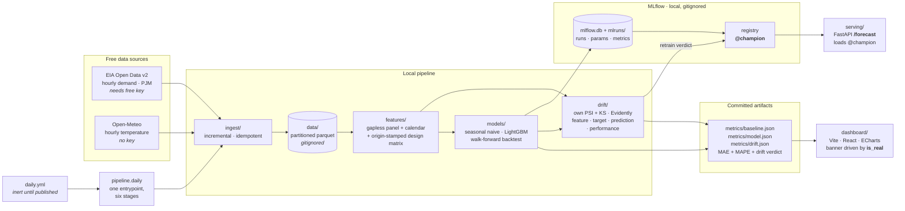

# energy-forecast-drift

Hourly **electricity demand forecasting** for a US balancing authority (PJM),
built around a live data feed so that **model drift is real, not simulated**.

The point of the project is not the forecast. It is the loop around it: a free
cron pulls fresh demand and weather every day, re-scores the model against the
actuals that arrive, and commits the metrics back to the repo — so drift
accumulates in public, week after week, and can be pointed at.

> **Milestone status: M0 → M6 complete** — ingestion, the seasonal-naive
> baseline, a global LightGBM scored on the same walk-forward folds, MLflow
> tracking + registry, the four-way drift suite with its retrain trigger, the
> single-command daily pipeline behind `daily.yml`, a FastAPI `/forecast` served
> from the registry alias, and the React dashboard over `metrics/`. The only
> thing left is real data — see **[docs/writeup.md](docs/writeup.md)** for what
> is real, what is fixture, and what a real drift episode will look like.

---

## ⚠️ Current state: the baseline number is pending an API key

The EIA API key had not been registered when this milestone was built, so
**there is no real demand history in the lake yet**, and therefore **no real
baseline MAE**.

- The Open-Meteo leg is **real and running today** — no key needed.
- The EIA client is **finished, not stubbed**, and runs the moment a key lands.
- `metrics/baseline.json`, `metrics/model.json` and `metrics/drift.json`
  currently hold numbers computed from a **seeded synthetic fixture**. They
  prove the pipeline executes end to end. They are **not a result and must not
  be quoted** — including the LightGBM-vs-baseline delta and the drift verdict
  below. Every artifact says so (`"is_real": false`).

Four steps to unblock it: **[docs/BLOCKED.md](docs/BLOCKED.md)**.

---

## Architecture



## Quickstart

```bash
uv sync --extra dev            # Python 3.11+, deps pinned in uv.lock

cp .env.example .env           # then paste your EIA key (see docs/BLOCKED.md)

uv run python -m ingest        # pull the delta from both sources
uv run python -m ingest        # re-run: reports +0 new rows — it is idempotent

uv run python -m models        # M1: walk-forward backtest -> metrics/baseline.json
uv run python -m models.train  # M2+M3: LightGBM vs baseline, MLflow -> metrics/model.json
uv run python -m drift.run --out metrics/drift.json   # M4: 4 drift types + retrain verdict

uv run python -m pipeline.daily  # M5: the whole loop -> metrics/*.json + PNGs
uv run python -m serving         # M5: FastAPI on :8000, /forecast from @champion

uv run pytest -v               # 157 tests, no network

cd dashboard && npm ci && npm run build   # M6: static dist/ over metrics/*.json
```

`python -m models.train` is the train/eval entrypoint: it scores **both** models
on the same folds, logs the run to MLflow, registers the refit LightGBM and
writes `metrics/model.json` + `metrics/model_table.md`. It takes ~1 min on the
fixture (56 refits), plus a one-off ~40 s the first time it creates `mlflow.db`.

Useful flags:

| Command | Effect |
|---|---|
| `python -m ingest --source weather` | run one leg only (`eia`, `weather`, `all`) |
| `python -m ingest --full-refresh` | ignore the lake and re-pull the whole backfill |
| `python -m models --source real` | fail loudly instead of falling back to the fixture |
| `python -m models --source synthetic` | force the fixture (what CI smoke-tests) |
| `python -m models --weeks 12` | widen the backtest window |
| `python -m models.train --no-mlflow` | score only; skip tracking and the registry |
| `python -m models.train --train-stride-hours 24` | fewer training origins → faster, weaker |
| `python -m models.train --num-boost-round 600` | longer boosting |
| `python -m drift.run --simulate-shift 12000` | inject a +12 GW level shift to watch the alarm fire (artifact is stamped `simulated_shift`) |
| `python -m drift.run --fail-on-retrain` | exit 1 when the verdict says retrain — usable as a CI gate |
| `python -m drift.run --no-evidently` | skip the optional second opinion |
| `DRIFT_PSI_ALERT=0.15 python -m drift.run` | override any threshold from the environment |
| `uv run mlflow ui --backend-store-uri sqlite:///mlflow.db` | browse the runs and the registry |

## Baseline (M1)

**Model:** seasonal naive — `demand(T) = demand(T - 168h)`, i.e. the same hour
one week earlier. For an hourly load series this single lag captures the daily
shape *and* the weekday/weekend split, which makes it a genuinely hard trivial
benchmark, and a much fairer one than a 24 h naive.

**Protocol:** walk-forward, 56 daily folds over the last 8 weeks. At each fold
cutoff `T0` the model sees the series strictly before `T0` and forecasts
`T0+1 … T0+24`. Metrics are computed per horizon, then pooled.

<details>
<summary><b>⚠️ SYNTHETIC — pipeline smoke test, NOT a result. Click to expand.</b></summary>

These numbers come from `models/fixtures.py` (a seeded curve), not from the
EIA. They exist only to show the backtest runs and the artifact is well formed.
The real table replaces this one as soon as the key lands.

| Horizon (h) | MAE (MWh) | MAPE (%) | RMSE (MWh) | Bias (MWh) | n |
|---:|---:|---:|---:|---:|---:|
| 1 | 2,621 | 3.36 | 3,155 | -779 | 56 |
| 6 | 2,491 | 3.27 | 3,244 | -485 | 56 |
| 12 | 2,681 | 2.53 | 3,322 | -500 | 56 |
| 18 | 2,906 | 2.46 | 3,397 | -520 | 56 |
| 24 | 2,844 | 3.46 | 3,623 | -178 | 56 |
| **overall** | **2,559** | **2.77** | 3,173 | -487 | 1,344 |

Full per-horizon table: [`metrics/baseline_table.md`](metrics/baseline_table.md).

</details>

**This MAE is the number every future model must beat** — on the same folds,
the same horizons and the same protocol. That is exactly how M2 is scored.

## M2 — LightGBM, on the same folds

**Model:** one **global, direct** LightGBM. A single booster covers all 24
horizons with `horizon_h` as an input feature, rather than 24 separate models or
a recursive one-step model fed its own output. Direct multi-horizon cannot
compound its own error the way recursion does, and a global fit sees 24× more
rows than a per-horizon fit — which matters when the history is months, not
years.

**Features (20)** — calendar (hour / day-of-week / month / weekend / US federal
holiday), demand lags at 24 h, 48 h, 168 h and 336 h, the same-hour-of-week mean
over four weeks, rolling mean/std/min/max of the last 24 h and 168 h, and the
Open-Meteo temperature in the same two shapes.

**Refit cadence:** the model is **retrained at every one of the 56 fold
cutoffs**, on exactly the rows whose target hour had already happened at that
instant. Fold 56's model never sees anything fold 1's model could not have seen.

<details>
<summary><b>⚠️ SYNTHETIC — pipeline smoke test, NOT a result. Click to expand.</b></summary>

Fixture-derived, exactly like the baseline table above. The *delta* is not a
benchmark either — it says the wiring works, nothing about PJM.

| | MAE (MWh) | MAPE (%) |
|---|---:|---:|
| seasonal naive | 2,559 | 2.77 |
| LightGBM | **2,181** | **2.38** |
| delta | **−378 (−14.8%)** | −0.39 pp |

LightGBM wins **23 of 24 horizons**. Full per-horizon comparison:
[`metrics/model_table.md`](metrics/model_table.md); machine-readable
[`metrics/model.json`](metrics/model.json).

Top gain-based importances: `demand_lag_168h` (39%),
`demand_same_hour_of_week_mean_4w` (20%), `demand_lag_48h` (7%),
`demand_lag_336h` (7%), `demand_lag_24h` (6%), `temp_lag_168h` (5%) — i.e. the
booster rediscovers the weekly seasonality the baseline hardcodes, and then adds
temperature and the recent level on top. That is the shape you would want to
see; on the fixture it is also the shape that was *put there*, so it confirms
the plumbing rather than the physics.

</details>

## M3 — MLflow tracking + registry

Every `models.train` run logs both models' per-horizon curves, the LightGBM
hyper-parameters and the panel provenance to **MLflow on a sqlite backend**,
then refits LightGBM on the whole panel and pushes it to the **model registry**.

sqlite rather than the default `./mlruns` file store for one reason: the file
store has **no registry**. The registry is the point of M3 — serving (M6) asks
for `models:/energy-demand-forecaster@champion` instead of a hardcoded path, so
promoting a model is a registry operation, not a deploy.

**Promotion is gated, not automatic.** The alias `@champion` is only moved onto
the new version when it actually beat the seasonal naive on the shared folds;
otherwise it lands as `@challenger` and the artifact records
`"beats_baseline": false`. A model that loses to a one-line baseline does not
get to be champion.

```bash
uv run mlflow ui --backend-store-uri sqlite:///mlflow.db   # runs, metrics, registry
```

`mlflow.db` and `mlruns/` are **gitignored and never committed** — they are
local run state. `metrics/*.json` stays the only published surface, and CI fails
the build if either ever gets tracked.

## M4 — the drift suite

```bash
uv run python -m drift.run --out metrics/drift.json
```

**Four drift types, because they are four different failure modes.** A monitor
that implements one of them is the usual mistake:

| | what moved | needs labels? | what it tells you |
|---|---|---|---|
| **feature** | the model inputs | no | leading indicator — the model may still be fine, if it does not lean on the column that moved |
| **target** | the observed demand | yes | a load regime the model was never fitted on |
| **prediction** | the model output | **no** | the *earliest* signal available in production, because actuals arrive late |
| **performance** | rolling MAE / MAPE | yes | the only signal that proves harm — and the slowest |

**PSI and KS are written out, not imported.** Both are three-line formulas
wrapped in a lot of edge cases, and the edge cases are where drift detectors
quietly stop working: a bin with zero reference mass makes PSI infinite, a
constant column collapses the quantile edges, a 30-row window makes everything
significant. `drift/stats.py` names and handles each one — reference-defined
bin edges open at ±∞ so out-of-range values are not silently dropped, shares
floored rather than skipped (a bin that lost all its mass is the event PSI
exists to catch), category binning for low-cardinality columns. The tests check
`D` against `scipy.stats.ks_2samp` to 1e-12 and the p-value to 1e-3, plus a
two-bin PSI worked out on paper.

**Evidently runs next to it, not instead of it.** It is an independent second
opinion with its own tests and thresholds; a disagreement would mean a bug in
our number. It is recorded in the artifact and **not** wired into the trigger,
and it is an optional dependency — a missing Evidently produces
`"status": "unavailable"`, never a failed pipeline.

**Calendar features are reported but never vote.** A 28-day reference against a
14-day current window necessarily spans different months, so `month` scores
PSI ≈ 7 on every healthy run and `is_holiday` swings on the luck of the
calendar. Letting deterministic functions of the timestamp drive the alarm
would mean firing every single day. They stay in the artifact — useful for
sanity-checking the window geometry — and are excluded from the verdict.

**Both scored windows are out of sample.** The history is cut three ways —
train / reference / current — and the booster is fitted on the train slice
*only*. Scoring the reference window with a model fitted on it would make the
reference errors flatteringly small and every later window look degraded
forever.

**The trigger is a policy, not a threshold.** Retraining on every PSI excursion
means retraining constantly — and often on a window too short to have learned
the new regime, producing a champion worse than the one it replaced. So:

| rule | condition | verdict |
|---|---|---|
| **R1** | performance alerts | **retrain** — measured harm, nothing else needed |
| **R2** | a distribution signal alerts *and* performance warns | **retrain** — cause plus visible effect |
| **R3** | two or more distribution signals alert | **retrain** — a regime change, act before the errors confirm it |
| **R4** | anything else non-`ok` | **watch** — charted, not acted on |
| **R5** | all four `ok` | **healthy** |

The verdict is a structure, never a bare bool: `should_retrain`, the rule that
fired, every reason as a metric/threshold pair, and a per-signal map. A pipeline
branches on one field; a human audits the rest.

**The alarm is tested in both directions.** `drift/simulate.py` injects a shift
of a stated size, and the tests assert the alarm fires on it — then run the
identical code path on the untouched fixture and assert it does not. A detector
that never fires is useless; one that always fires is worse, because it trains
people to ignore it.

<details>
<summary><b>⚠️ SYNTHETIC — pipeline smoke test, NOT a result. Click to expand.</b></summary>

On the fixture the current verdict is **WATCH**: feature drift alerts (the
fixture carries a real annual cycle, so mid-June-vs-mid-July temperature and
rolling-level features genuinely move), while target, prediction and
performance stay quiet. That is exactly the case R4 exists for — a leading
indicator with no measured harm behind it.

Injecting a +12,000 MW level shift over the current window flips all four
signals to `alert` and the verdict to **RETRAIN** under R1, with the reference
MAE roughly tripling. Reproduce with `--simulate-shift 12000`; the artifact is
stamped `simulated_shift` so a demo can never be mistaken for an observation.

Full report: [`metrics/drift_summary.md`](metrics/drift_summary.md); machine
readable [`metrics/drift.json`](metrics/drift.json).

One honest caveat visible in that artifact: PSI is scale-free *relative to the
reference spread*, so heavily smoothed features (`demand_roll_mean_168h`) show
enormous PSI for level moves that are small in MW. Narrow reference bins make
small absolute moves look catastrophic. That is a property of PSI, not a bug —
it is why the section verdict uses the share of drifted columns rather than the
maximum, and why a distribution alert alone does not retrain.

</details>

## M5 — the daily pipeline and serving

### One entrypoint, six stages

```bash
uv run python -m pipeline.daily          # ingest → features → score → monitor → drift → artifacts
```

```
ingest → features → score → rolling-MAE monitor → drift → metrics/*.json + 2 PNGs
```

**Everything the cron does lives in Python, not in YAML.** `daily.yml` runs
exactly one command. A pipeline spread across ten workflow steps can only be
debugged by pushing a commit and watching a red tick; this one runs on a laptop
and has tests. Each stage records its status, duration and a detail block into
`metrics/pipeline.json`, which is written **even when the run fails** — a failed
cron leaves an artifact explaining itself instead of only a red tick.

**Ingestion is the only stage allowed to degrade.** A source being down must not
stop the model being re-scored against the history already in the lake.
Everything after it is fatal, because a scoring step that silently half-worked
is worse than a failed run.

**`--require-eia-key` makes the worst failure mode impossible.** A cron that
quietly publishes fixture numbers as if they were data is the single worst thing
this repo could do, so the workflow passes that flag: no key means exit 2 with
printed instructions, before a single byte is written. Locally, without the
flag, the same entrypoint degrades to the fixture — which is what keeps the
whole thing runnable and testable today.

**The monitor refuses to score itself.** This one is subtle and it is the bug
this milestone actually had. The registry champion is refit on *all* available
history, so by the time it is promoted it has already seen the reference and
current windows; scoring them with it gives in-sample errors — on this fixture,
MAE ≈ 1,015 MWh against the ≈ 2,657 the same model gets out of sample. Every
future window would then look catastrophic against a reference that was never
real. So training runs now tag the model with `train_data_end_utc`, and the
monitor uses the champion **only** when that tag proves its data stopped before
the reference window opens. Otherwise it fits its own booster on the train slice
and records why, in the artifact. A missing tag counts as ineligible: unknown is
not safe.

Because of that, `metrics/*.json` distinguishes two models and never conflates
them: `served_model` (what `/forecast` returns) and `monitoring_model` (what
scored the windows the alarm reads).

| Artifact | What it holds |
|---|---|
| `metrics/forecast.json` | day-ahead forecast vs the actual that arrived, plus the live forward forecast whose actuals do not exist yet |
| `metrics/monitor.json` | rolling MAE/MAPE per day, the reference level and the retrain line |
| `metrics/drift.json` | the four drift sections + the retrain verdict |
| `metrics/pipeline.json` | the run record: stage statuses, durations, artifacts, provenance |
| `metrics/forecast_vs_actual.png`, `metrics/rolling_mae.png` | the same two stories as images — watermarked `SYNTHETIC FIXTURE` while `is_real` is false |

### Serving: `/forecast` from the registry alias

```bash
uv run python -m serving                                  # http://127.0.0.1:8000/docs
curl 'http://127.0.0.1:8000/forecast?max_horizon=6'
```

```json
{
  "origin_utc": "2026-07-28T01:00:00+00:00",
  "is_real": false,
  "warning": "These numbers come from a SEEDED SYNTHETIC FIXTURE ...",
  "model": {
    "uri": "models:/energy-demand-forecaster@champion",
    "version": "2",
    "trained_on_real_data": false
  },
  "forecast": [{ "horizon_h": 1, "target_utc": "...", "forecast_mwh": 78091.6, "actual_mwh": null }]
}
```

**No path is hardcoded.** The booster comes from
`models:/energy-demand-forecaster@champion`, so promoting a challenger is a
registry operation and nothing is redeployed. `/model` reports which version
actually answered.

**Features are not re-implemented for serving.** The request goes through the
same `features.build.build_design_matrix` that produced the training matrix, so
a feature cannot be computed one way for fitting and another way for serving —
the classic training/serving skew.

**Origins outside the information set are refused, not guessed.**
`build_design_matrix` does not complain about an origin with no history behind
it; it emits NaN features, which LightGBM consumes happily and turns into a
confident-looking number. `/forecast` bounds the origin to
`[panel_start + 672h, last_observed + 1h]` and returns 422 with the valid range.

**Every response carries its provenance**, and `is_real` is true only when the
panel *and* the model are real. A champion trained on the fixture keeps the
response synthetic even after real demand lands in the lake — until it is
retrained, the forecast is still a fixture artifact.

## M6 — the dashboard

```bash
cd dashboard && npm ci && npm run build && npx serve dist
```

Vite + React + ECharts, static output, **no deploy step in this repo**. The build
copies `metrics/*.json` into `dist/data/`, so the result is a directory that can
be served from anywhere — and because the data is *fetched* rather than inlined
into the bundle, pointing it at a fresher `metrics/` needs no rebuild.

**The banner is driven by the flag, not by copy.** While `"is_real"` is false,
the page leads with a red banner saying plainly that every number came from a
seeded synthetic fixture and quoting the artifact's own `warning` field. There is
no prop or build flag that overrides it — `ProvenanceBanner` branches on the
artifact and nothing else. Flip `is_real` on a *copy* of `dist/data` and the same
code renders a green "Live data" banner instead; `dashboard/README.md` has the
one-liner. That is the whole demonstration: same code, same numbers, the banner
follows the data.

Four charts, and the decisions behind them:

| Chart | Reads | Why it looks like that |
|---|---|---|
| Forecast vs actual | `forecast.json` | The live forecast keeps the *forecast* hue and is separated by dash pattern and a shaded band — it is the same entity as the scored forecast, it just has no actual yet. A third colour would claim otherwise. |
| Drift over time | `drift.json` → `timeline` | Feature PSI runs ~100× the target and prediction PSI. **Not** a second y-axis — that would invent an alignment between two scales. A log axis keeps one scale, with the warn/alert thresholds drawn so the eye reads distance from the line. |
| Rolling forecast error | `monitor.json` | Daily MAE as thin bars, rolling mean as a line, reference level and retrain line as dashed rules, current window shaded. One axis, two marks. |
| Feature drift right now | `drift.json` | **Dots, not bars.** PSI spans three orders of magnitude here, so the axis has to be logarithmic — and a bar's length on a log axis is measured from the axis minimum, which would make a feature at PSI 0.02 look two thirds as drifted as one at 6.7. A dot encodes value by position, which survives any scale. |

Every chart has a table-view toggle, because a tooltip must never be the only path
to a value. The palette lives once in `styles.css` as CSS custom properties and is
read back at render time — ECharts needs literal hex, and a second copy in
TypeScript would drift from the stylesheet, most visibly in dark mode. Three
categorical slots plus a reserved status palette, validated in both modes against
both surfaces (worst all-pairs CVD ΔE 9.2 light / 9.4 dark).

## Design decisions worth defending

**Ingestion is incremental *and* idempotent.** The store de-duplicates on
`(entity, timestamp)` keeping the newest row, so re-running never duplicates an
hour — and because the EIA revises recent values, every run deliberately
re-pulls a 3-day tail so revisions *overwrite* stale numbers instead of being
ignored forever. Partition files are written to a temp path and moved into
place, so an interrupted run cannot leave a corrupt parquet.

**No temporal leakage, enforced in four independent places.**
`backtest._history_before` slices with `index < cutoff` (strictly — the hour
stamped `T0` is not complete at `T0`); `baseline.predict` re-asserts that neither
the history it received nor the seasonal lag it is about to read touches the
cutoff; `features.build` pins every feature to its forecast origin (below); and
`lgbm.training_slice` admits a training row only once its *label hour* is over,
raising if the slice ever reaches the cutoff. Tests poison every value after the
last fold and assert the metrics do not move — for both models — spy on the
model to assert it never saw a timestamp `>= cutoff`, and spy on the training
slice to assert the same of every label.

**Features are stamped with an origin, not a target.** A row of the design
matrix is a *(origin `O`, horizon `h`)* pair, and every feature on it must be a
function of data strictly before `O` — not before the target `T = O + h`. That
distinction is where feature engineering usually leaks: a 24 h lag looks
innocent, but for a 24 h-ahead forecast `T - 24h` **is** the origin, an hour
that has not finished yet. So lags are computed against the target and then
masked out when they would reach the origin; LightGBM eats the resulting NaN
natively, and `horizon_h` is a feature, so the model learns that distant
horizons simply have less to go on. Tests poison every value from the origin
onwards and assert that not one feature column moves.

**Only past weather is used.** Open-Meteo publishes a forecast, and the lake
already tags it `is_observed=False`, so a production forecaster could legitimately
feed tomorrow's forecast temperature in. This one does not — that would make the
"features use only data ≤ origin" claim depend on a second, unmodelled forecast,
and the point of this repo is that the rigour claims are *testable*. Wiring the
forecast leg in is a later, explicit step, not a silent one.

**Promotion is earned.** The registry alias `@champion` moves only when the
challenger beat the seasonal naive on identical folds; otherwise it is filed as
`@challenger`. Auto-promoting whatever trained last is how a worse model reaches
production quietly.

**The panel is gapless.** Missing hours become explicit NaNs rather than
shifting the index, so "168 rows ago" and "168 hours ago" stay the same thing.
A fold with a gap in its actuals is *skipped and reported*, never silently
scored — so every horizon is evaluated on an identical fold set and the columns
are comparable.

**Secrets cannot leak.** `.env` is gitignored, URLs are redacted before logging
and secret-looking query params are masked; a test asserts a key cannot survive
either path. A 401/403 is never retried — a bad key only burns quota.

**Rate limits are respected structurally.** All HTTP goes through one helper:
max 3 attempts, exponential backoff (2s/4s/8s), `Retry-After` honoured and
capped, sleeps between pages, and only transient statuses retried. No client
can bypass it.

**The lake is not committed.** `data/` is gitignored; `metrics/` holds only
small JSON that the future cron will refresh — it is the published surface the
M6 dashboard will read.

## Layout

```
ingest/     EIA v2 + Open-Meteo clients, polite HTTP, partitioned parquet store
features/   panel.py  gapless hourly panel, weather join, calendar
            build.py  origin-stamped design matrix (lags, rolling, holiday)
models/     baseline.py seasonal naive · lgbm.py global LightGBM
            backtest.py walk-forward protocol (shared by both models)
            tracking.py MLflow sqlite + registry · train.py the M2/M3 entrypoint
drift/      stats.py  own PSI + two-sample KS (no scipy at runtime)
            windows.py train/reference/current split, both scored out of sample
            detectors.py the four drift types · trigger.py the retrain policy
            config.py every threshold · evidently_report.py second opinion
            simulate.py injected shifts (tests + demo) · run.py the M4 entrypoint
pipeline/   daily.py  the six-stage entrypoint daily.yml calls
            plots.py  the two committed PNGs (watermarked when synthetic)
serving/    app.py    FastAPI /forecast /model /health from the registry alias
metrics/    committed artifacts: baseline.json, model.json, drift.json,
            forecast.json, monitor.json, pipeline.json + tables + 2 PNGs
dashboard/  Vite + React + ECharts over metrics/*.json — no deploy step here
tests/      157 tests: idempotency, leakage (backtest *and* features), retries,
            secret redaction, registry wiring, PSI/KS vs scipy, drift injection,
            the daily chain, the HTTP surface, and both workflow YAMLs
docs/       writeup.md (real vs fixture, three bugs, what a real episode looks
            like) · spec.md (original brief) · BLOCKED.md (the EIA key)
.github/    ci.yml (active on publish) · daily.yml (inert until published)
mlruns/     MLflow artifacts — gitignored, never committed (nor is mlflow.db)
reports/    Evidently HTML (~5MB of inlined plotly) — gitignored
```

## What is left

Exactly one thing: **real data.**

| | |
|---|---|
| **gated on the EIA key** | backfill two years of hourly PJM demand, re-run `models.train` and `pipeline.daily` against it, and every artifact flips to `"is_real": true` — the banner turns green, the watermark disappears, and the numbers in this README become results |
| **then** | uncomment the `schedule:` block in `daily.yml` and let drift accumulate in public |
| **M7** | one real drift episode, captured end to end, appended to the writeup |

The five steps to unblock it are in [`docs/BLOCKED.md`](docs/BLOCKED.md); what
will change, and what a real episode is predicted to look like, is in
[`docs/writeup.md`](docs/writeup.md). Full brief:
[`docs/spec.md`](docs/spec.md).

## Cost

R$0. EIA and Open-Meteo are free, GitHub Actions is free on a public repo, and
the dashboard is a static `dist/`. No server stays on.
